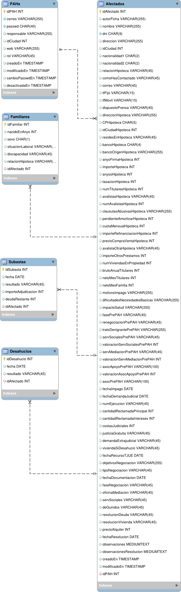

Modelo de datos
---------------

Para diseñar la base de datos hemos empleado el software libre multiplataforma
[MySql Workbench](http://dev.mysql.com/downloads/workbench/).
El diseño aún no es definitivo, está en proceso:

[Descargar última versión de modelo2.mwb](modelo2.mwb?raw=true)

[Descargar versión inicial del modelo.mwb](modelo.mwb?raw=true)

Diagrama ERR
============

Tras las últimas reuniones se han fusionado la tabla Hipotecas con Afectados. 
Desaparecen las tablas Ciudades, Provincias, Sucursales y Bancos,
la información asociada que proveian esas tablas ahora se controlan desde la 
aplicación, almacenandose sólo el código asociado a esas entidades en la BD.
Asimismo se añaden dos nuevas tablas: Desahucios y Subastas, para poder llevar
un histórico asociado a un expediente.

