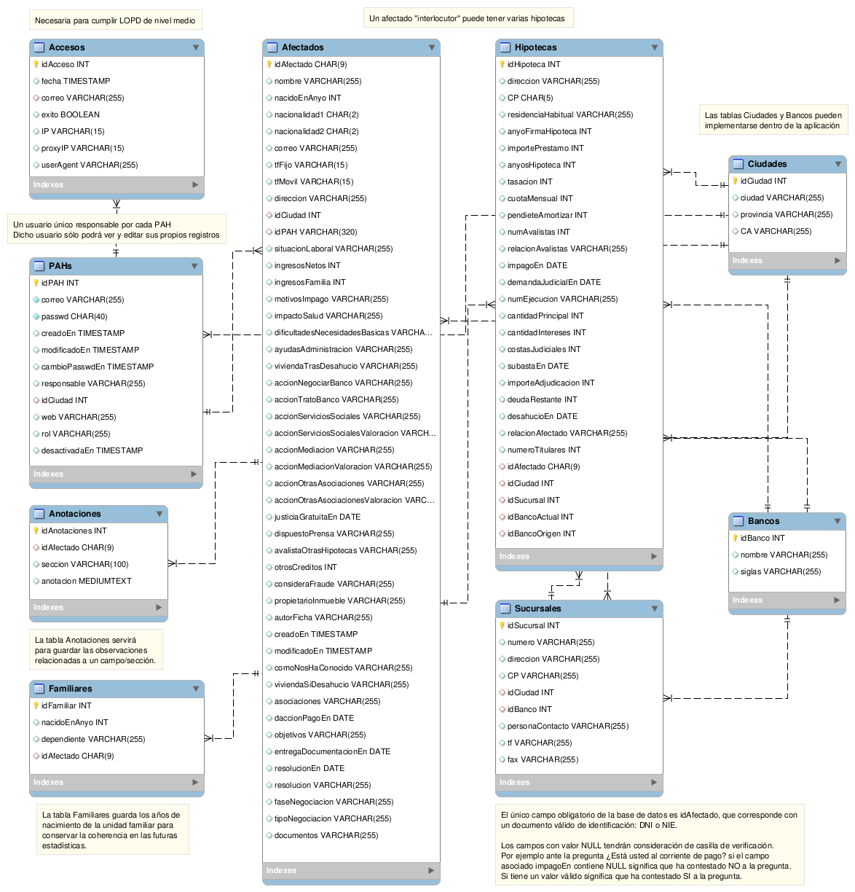

Modelo de datos
---------------

Para diseñar la base de datos hemos empleado el software libre multiplataforma
[MySql Workbench](http://dev.mysql.com/downloads/workbench/).
El diseño aún no es definitivo, está en proceso:

[Descargar última versión de modelo.mwb](modelo.mwb)

Diagrama ERR
============

